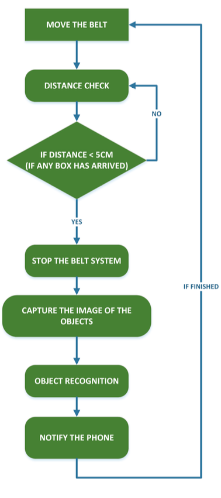
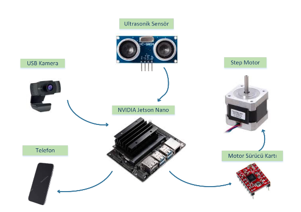
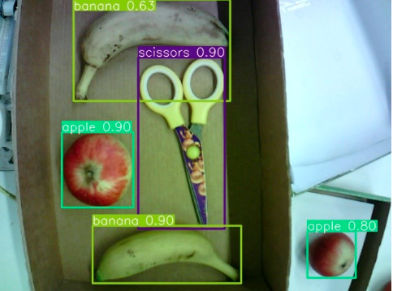

# ELE495
## ELE495 Final Project Repo

### Introduction
### Kıvanç Kaan Bozkurt, Ahmet Kutay Akpınar, Aylin Oylan, Emre Barış

The aim of the graduation project is to realize a conveyor belt product identification system. With the camera connection to be positioned on the conveyor system, the selected products should be identified as product types and numbers. After this process, the conveyor belt should continue to move forward and the product type and number information should be sent to the phone.


### Flowchart





### Working Principle

While the designed conveyor belt system continues its movement, the box containing the products is left from one side of the belt and moves forward. Thanks to the continuous distance measurement by means of an ultrasonic sensor, when the box is in front of the camera, the motor is commanded to stop and the image processing process is started. The products in the box are obtained with accuracy percentages. These accuracy values are evaluated and if they are below the threshold value, they are labeled as "unknown". The data obtained is transferred to a phone using the API via HTTP protocol. All these processes are performed using only NVIDIA Jetson Nano.

### Image Recognition

YOLO (You Only Look Once) is a real-time object detection algorithm for object recognition and uses Convolutional Neural Network (CNN) techniques. The COCO dataset was trained with the COCO dataset, which includes a wide range of object classification and detection tasks, and its experimentation with products selected from this dataset is shown below.



### Starting Our Application

To start our program first we need to overclock our Jetson Nano developer kit in order to use our ultrasonic module. To do that we enter the "$sudo jetson_clocks" command in our terminal.

``` $sudo jetson_clocks ```

After entering this prompt we can now start our program. Our python file is using the version 3.9 so we have to start it by calling "$python3.9". To start our program you should have root priviliges because our GPIO library needs to access to the pins and we can achieve this by adding sudo command before calling our python interpreter.

``` $sudo python3.9 yolo_main.py ```

After running the code, the program should start automatically.